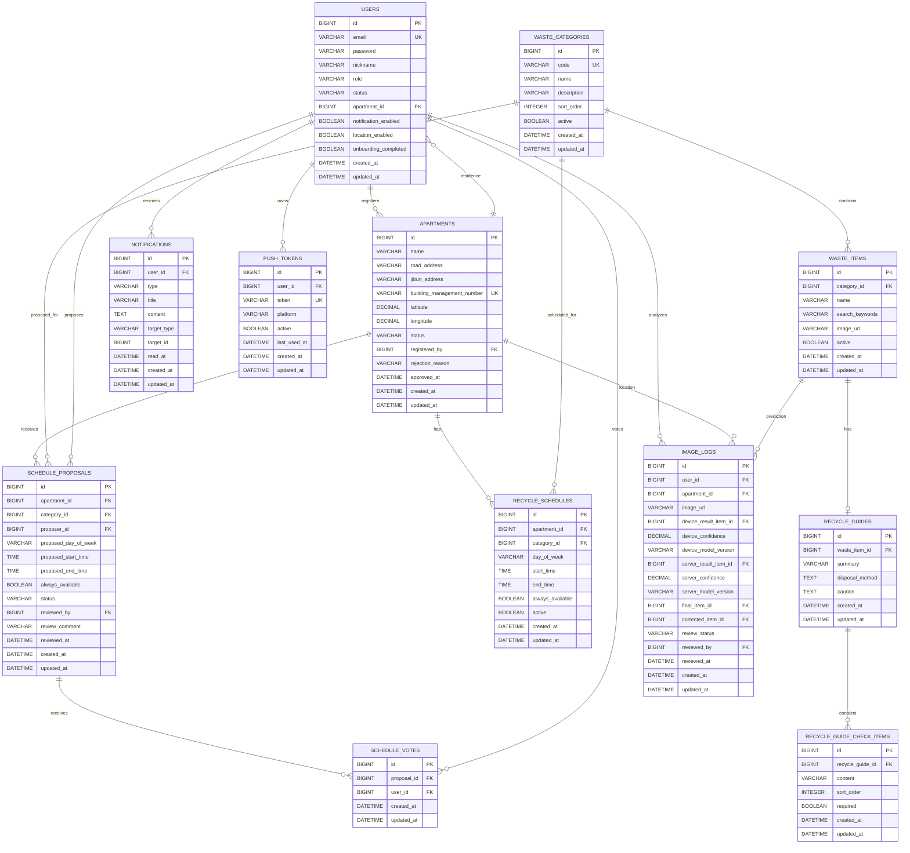

# SmartRecycle ERD

## 1. 문서 목적

SmartRecycle의 Spring Boot 백엔드에서 사용할 핵심 도메인과 데이터베이스 관계를 정의한다.

사용자 앱 Flutter와 관리자 웹 React는 동일한 Spring Boot API를 사용하며,
서비스의 데이터와 비즈니스 규칙은 MySQL에서 통합 관리한다.

---

## 2. 핵심 도메인

| 도메인 | 역할 |
|---|---|
| User | 회원 계정, 권한, 사용자 설정 |
| Apartment | 사용자가 거주하는 아파트와 승인 상태 |
| WasteCategory | 플라스틱, 종이류 등 폐기물 분류 |
| WasteItem | 페트병, 종이컵 등 실제 검색 품목 |
| RecycleGuide | 품목별 분리배출 방법 |
| RecycleGuideCheckItem | 분리배출 전 확인할 체크리스트 |
| RecycleSchedule | 아파트별 폐기물 배출 일정 |
| ScheduleProposal | 주민이 제안한 배출 일정 |
| ScheduleVote | 주민 일정 제안에 대한 투표 |
| ImageLog | 모바일·서버 AI의 이미지 분석 기록 |
| Notification | 사용자에게 전달되는 앱 내부 알림 |
| PushToken | 모바일 푸시 알림 기기 토큰 |

---

## 3. ERD



---

## 4. 주요 관계

### 4.1 User와 Apartment

- 한 사용자는 하나의 아파트를 선택할 수 있다.
- 아파트 초기 설정 전에는 `apartment_id`가 `NULL`일 수 있다.
- 한 아파트에는 여러 사용자가 거주할 수 있다.
- 사용자는 검색 결과에 없는 신축 아파트를 임시 등록할 수 있다.
- 임시 등록된 아파트는 관리자의 승인을 받아야 한다.

관계:

```text
Apartment 1 : N User
```

---

### 4.2 WasteCategory와 WasteItem

`WasteCategory`는 넓은 분류이고 `WasteItem`은 사용자가 검색하거나 AI가 인식하는 실제 품목이다.

예시:

```text
플라스틱
├─ 투명 페트병
├─ 플라스틱 용기
└─ 일회용 숟가락

종이류
├─ 종이 상자
├─ 종이컵
└─ 우유팩
```

관계:

```text
WasteCategory 1 : N WasteItem
```

---

### 4.3 WasteItem과 RecycleGuide

한 품목에는 하나의 대표 분리배출 가이드를 연결한다.

```text
투명 페트병
├─ 내용물을 비운다.
├─ 라벨을 제거한다.
├─ 찌그러뜨린다.
└─ 뚜껑을 닫아 배출한다.
```

관계:

```text
WasteItem 1 : 0..1 RecycleGuide
RecycleGuide 1 : N RecycleGuideCheckItem
```

---

### 4.4 Apartment와 RecycleSchedule

아파트마다 폐기물 카테고리별 배출 일정이 다를 수 있다.

예시:

```text
스마트아파트
├─ 플라스틱: 화요일 18:00~22:00
├─ 종이류: 목요일 18:00~22:00
└─ 일반 쓰레기: 상시 배출
```

관계:

```text
Apartment 1 : N RecycleSchedule
WasteCategory 1 : N RecycleSchedule
```

---

### 4.5 ScheduleProposal과 ScheduleVote

주민이 제안한 일정 내용과 각 사용자의 투표 기록을 분리한다.

`ScheduleProposal`은 일정 제안 자체를 저장하고,
`ScheduleVote`는 누가 해당 제안에 투표했는지를 저장한다.

관계:

```text
ScheduleProposal 1 : N ScheduleVote
User 1 : N ScheduleVote
```

한 사용자는 같은 제안에 한 번만 투표할 수 있다.

---

### 4.6 ImageLog

하나의 이미지 분석 기록에는 다음 결과를 함께 저장한다.

1. Flutter TensorFlow Lite 결과
2. Python YOLO 서버 결과
3. 최종 선택 품목
4. 사용자가 수정한 품목
5. 관리자의 검수 결과

이를 통해 AI 오답을 추후 재학습 데이터로 사용할 수 있다.

---

## 5. 상태 Enum

### UserStatus

```text
ACTIVE
SUSPENDED
WITHDRAWN
```

### ApartmentStatus

```text
PENDING
APPROVED
REJECTED
```

### ScheduleProposalStatus

```text
PENDING
APPROVED
REJECTED
CANCELLED
```

### ImageReviewStatus

```text
NOT_REQUIRED
PENDING
APPROVED
REJECTED
```

### NotificationType

```text
SCHEDULE_REMINDER
SCHEDULE_CHANGED
APARTMENT_APPROVED
APARTMENT_REJECTED
NOTICE
```

### DevicePlatform

```text
ANDROID
IOS
```

---

## 6. 중복 방지 제약조건

| 테이블 | UNIQUE 조건 | 목적 |
|---|---|---|
| users | email | 동일 이메일 중복 가입 방지 |
| apartments | building_management_number | 같은 건물 중복 등록 방지 |
| waste_categories | code | 카테고리 코드 중복 방지 |
| waste_items | category_id, name | 같은 카테고리의 품목명 중복 방지 |
| recycle_guides | waste_item_id | 품목당 가이드 한 개 유지 |
| recycle_schedules | apartment_id, category_id, day_of_week | 동일 일정 중복 방지 |
| schedule_votes | proposal_id, user_id | 사용자 중복 투표 방지 |
| push_tokens | token | 같은 기기 토큰 중복 등록 방지 |

---

## 7. 주요 인덱스

| 테이블 | 인덱스 |
|---|---|
| users | email, apartment_id, status |
| apartments | name, building_management_number, status |
| waste_items | name, category_id, active |
| recycle_schedules | apartment_id, category_id, day_of_week |
| schedule_proposals | apartment_id, category_id, status |
| schedule_votes | proposal_id, user_id |
| image_logs | user_id, review_status, created_at |
| notifications | user_id, read_at, created_at |
| push_tokens | user_id, active |

---

## 8. 삭제 정책

### User

회원 데이터는 즉시 삭제하지 않고 상태를 `WITHDRAWN`으로 변경한다.

```text
Hard Delete 사용 안 함
```

### Apartment

사용자나 일정이 연결된 아파트는 삭제하지 않고 상태로 관리한다.

```text
APPROVED
PENDING
REJECTED
```

### WasteCategory / WasteItem

기존 분석 기록과 일정이 참조할 수 있으므로 삭제하지 않고 `active=false`로 비활성화한다.

### RecycleSchedule

일정 변경 이력을 위해 기존 데이터는 비활성화하고 새 일정을 등록할 수 있다.

### ImageLog

AI 학습 및 검수 자료이므로 사용자가 탈퇴해도 익명화 후 일정 기간 보관할 수 있다.

### Notification

알림은 일정 기간 이후 배치 작업으로 삭제할 수 있다.

---

## 9. 설계 결정 사항

### WasteItem 추가

초기 로드맵에는 `WasteCategory`만 표시되어 있지만,
카테고리 필터와 실제 품목 검색을 구분하기 위해 `WasteItem`을 추가한다.

```text
WasteCategory: 플라스틱
WasteItem: 투명 페트병
```

### ScheduleProposal 추가

일정 제안 내용과 사용자의 투표 기록을 하나의 테이블에 저장하지 않고 분리한다.

```text
ScheduleProposal: 주민이 제안한 일정
ScheduleVote: 해당 제안에 투표한 사용자
```

### PushToken 추가

Flutter 푸시 알림을 보내기 위해 사용자별 모바일 기기 토큰을 별도로 관리한다.

---

## 10. 구현 예정 순서

```text
1. User 확장
2. Apartment
3. WasteCategory
4. WasteItem
5. RecycleGuide
6. RecycleGuideCheckItem
7. RecycleSchedule
8. ScheduleProposal
9. ScheduleVote
10. ImageLog
11. Notification
12. PushToken
```